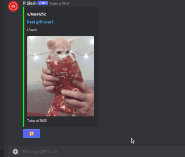

) 

# R Slash
R Slash is a [Discord bot](https://discord.com) that allows users to get [Reddit](https://reddit.com) posts from popular subreddits, or any subreddit if they are a premium subscriber.

# Usage
## Get post from subreddit

## Get another post from same subreddit

## Search by post title

## Get post from custom subreddit

# Technical Overview
R Slash runs on a single-node Kubernetes cluster on my home server. The main reason for this was the Discord API requires a new process for each set of 2000 guilds the bot is on. Using k8s made this really easy to do. Additionally, in the future I might need to scale beyond one node, either for performance, or reliability purposes. Developing on k8s now makes migrating to a multi-node configuration later easier.

## Architecture

## Shard
Each shard is responsible for 2000 Discord guilds. It receives commands and sends the appropriate response. It fetches Reddit posts from Redis and constructs a Discord embed that can be sent. If a premium command is issued, it checks MongoDB to ensure the user has an active subscription.

## Downloader
The downloader currently runs in two forms. One is in a constant loop (obeying rate-limits) checking Reddit for new posts on the built-in subreddits, and one sits waiting for a new custom subreddit request.

The process for updating a subreddit is as follows:

- Get list of existing posts
- Loop X times where X is the number of pages of 100 posts to fetch
  - get page of posts
  - For each post (execute in parallel threads)
    - Skip if invalid (no images, deleted, etc)
    - If not in our cache: resolve URL to direct file link
    - If subreddit hasn't been fetched before (a user is waiting for this to finish downloading!):
      - Generate post object and push to redis + subreddit list
    - Else
      - Generate post object and append to local list

- push to redis, overriding the slightly incorrect ordering due to thread timings if we decided to push inside the threads

### Resolving URLs
In order to use the image/gif content in the custom embeds that you can see in the usage section, they must be direct file links. Although Discord will embed imgur gallery links (for example) if you post them directly into the chat, it will not do that if you set it as the content of a custom embed. This means the downloader needs to talk to different site APIs to resolve to a direct file link. For example: "https://imgur.com/a/w6uDYLW" to "https://i.imgur.com/LIcehKQ.jpg". Additionally, Discord won't render embed content that is an MP4, despite the fact that almost all gif hosts now actually store the files as MP4s. To get around this, the downloader will download any MP4 urls encountered, convert them to GIF and host them on R Slash's CDN.

## Membership Updater
R Slash processes payments through [Ko-Fi](https://ko-fi.com/rslash). The tricky bit is associating a Ko-Fi user with a Discord user. Ko-Fi has a simple system where you can subscribe to webhook updates containing transaction information. Unfortunately, this doesn't include the user's Discord account. Fortunately though, Ko-Fi has their own Discord bot that allows you to give members of your Discord guild a specific role if they are a Ko-Fi supporter. We can use this to determine if a user of the bot has an active Ko-Fi subscription. We just run a small service that monitors the Discord API for role changes in the bot's support guild. If a user gains the Supporter role, push a new subscription period to the user's entry in MongoDB with a start timestamp of the current time. If a user loses the Supporter role, add an end timestamp to the most recent subscription period. Now any shard can check a user's subscription status as so:
- Check DB for user entry, if not exists, no subscription
- If exists and current subscription has no end timestamp, they have a subscription.
- If exists and has an end timestamp, check if it has passed.

Obviously this system isn't amazing. There are two main issues:
- The user has to be in the support server
- The user has to create an account with an external provider (Ko-Fi)

In the future I'd like to create my own website that simply asks the user to authorize with Discord and takes payment there.

## Discord Interface
The Discord Interface just repeatedly queries the Discord API on how many shards should be running and then tells Kubernetes to scale the shards set to that many.